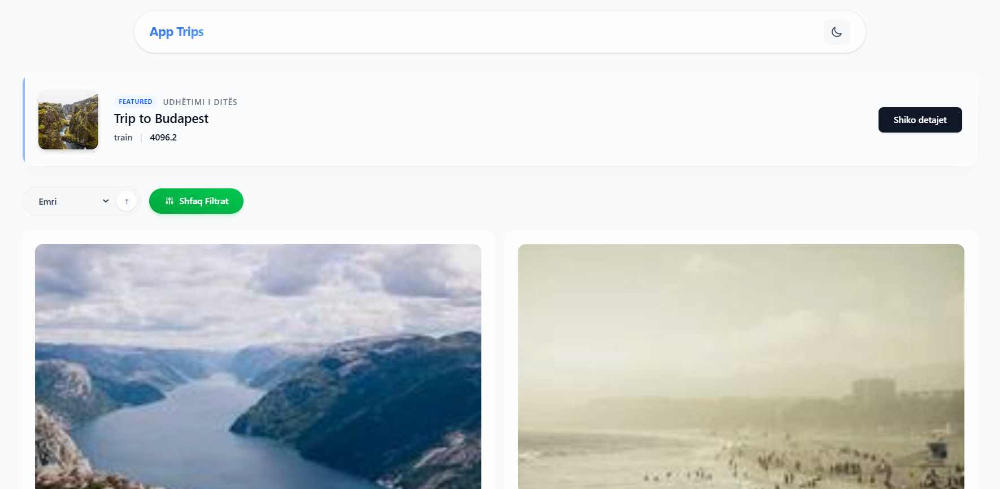
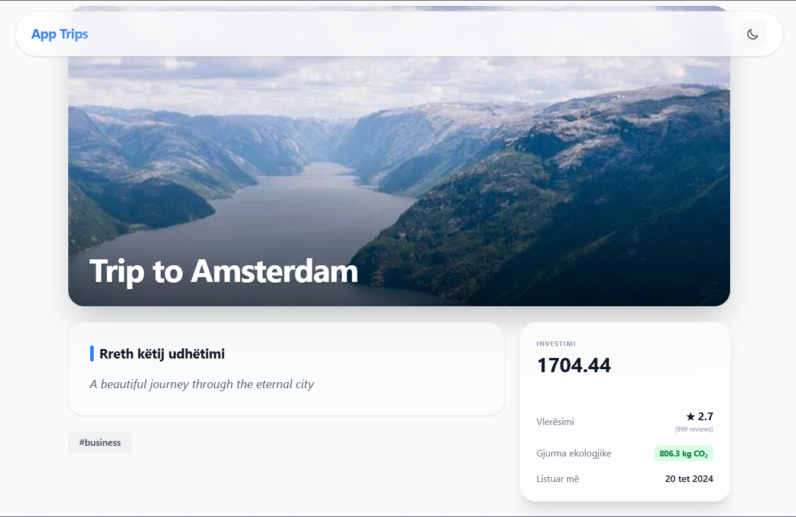
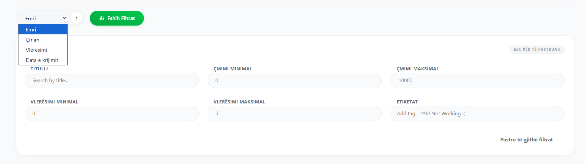
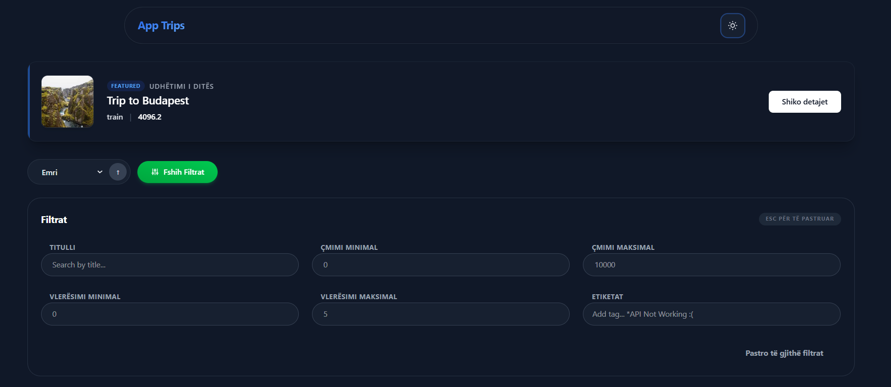

# App Trips

App Trips is an Angular application that serves as the main platform for users to view and explore trip data. Built with scalability and performance in mind, it provides a seamless experience for browsing trips, sorting them by various criteria, and viewing detailed information.

## Features

### Home Page
- Displays a list of trips with name, basic traits, and thumbnail images.
- Sorting functionality by price, creation date, rating, name, or vertical type.
- "Trip of the Day" button that selects a featured trip, remaining consistent throughout the day.
- Score badges for each trip based on rating, number of ratings, and CO2 emissions, categorized into three tiers: average, good, and awesome.

### Trip Detail Page
- Accessible by clicking on a trip from the home page.
- Shows a larger photo and all trip data, including the description.
- Smooth navigation back to the home page, preserving any applied sorting.

### Navigation
- Intuitive navigation between home and detail pages.
- Sorting state is maintained when navigating back from the detail page.

### Internationalization (i18n)
- Supports multiple languages including Albanian (sq), Italian (it).
- Uses Angular's built-in i18n framework for efficient localization.

### Theming
- Light and dark theme support for better user experience.
- Theme can be toggled based on user preference.

### Caching
- Implements caching strategies to improve performance, especially important for handling potentially millions of trips.
- Reduces API calls and enhances load times.

## Screenshots

### Home Page

*Figure 1: Home page displaying trip list with sorting options and trip of the day.*

### Trip Detail Page

*Figure 2: Detailed view of a selected trip with full information.*

### Sorting Functionality

*Figure 3: Sorting options applied to the trip list.*

### Score Badges

*Figure 4: Trip cards showing score badges based on calculated ratings.*

### Dark Theme

*Figure 5: Application in dark theme mode.*

## Technical Implementation

### Caching
To handle large datasets efficiently, the application implements caching at multiple levels:
- HTTP response caching for API calls
- In-memory caching for frequently accessed data
- Service-level caching to minimize redundant requests

### Internationalization (i18n)
- Utilizes Angular's i18n framework with XLIFF translation files
- Supports dynamic locale switching
- Ensures all user-facing text is translatable

### Theming
- CSS custom properties for theme variables
- Angular's HostBinding for dynamic theme application
- Persistent theme selection using local storage

### Performance Considerations
- Lazy loading for routes to improve initial load times
- OnPush change detection strategy for optimized rendering
- Virtual scrolling for large lists (future enhancement)
- Optimized images using Angular's NgOptimizedImage

## Getting Started

### Prerequisites
- Node.js (v18 or higher)
- npm

### Installation
1. Clone the repository
2. Install dependencies:
   ```bash
   npm install
   ```

### Running the Application

#### Development Server
To start the development server:
```bash
ng serve
```
Navigate to `http://localhost:4200/`. The app will automatically reload if you change any of the source files.

#### Production Build
To build the project:
```bash
ng build
```
The build artifacts will be stored in the `dist/` directory.

#### Localized Builds
To run the application in different languages:

For Albanian:
```bash
ng serve --configuration=sq
```

For Italian:
```bash
ng serve --configuration=it
```

### Testing

#### Unit Tests
To execute unit tests with Vitest:
```bash
ng test
```

#### End-to-End Tests
To run end-to-end tests:
```bash
ng e2e
```

### API
The application uses the following API:
https://iy3ipnv3uc.execute-api.eu-west-1.amazonaws.com/Prod/docs

## Architecture

- **Standalone Components**: All components are standalone for better tree-shaking and performance
- **Signals**: Uses Angular signals for reactive state management
- **Services**: Singleton services for data management and caching
- **Lazy Loading**: Feature modules are lazy-loaded for optimal bundle sizes
- **Accessibility**: WCAG AA compliant with proper ARIA attributes and keyboard navigation

## Contributing

1. Follow Angular best practices and the provided coding standards
2. Ensure all tests pass before submitting
3. Update documentation as needed
4. Use conventional commit messages

## License

This project is licensed under the MIT License.
